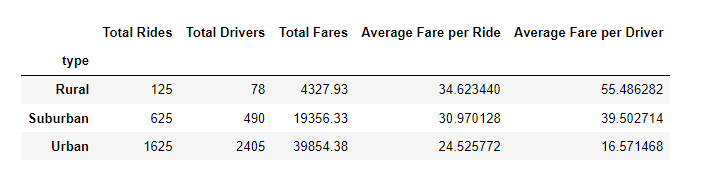

# PyBer_Analysis
Analyzing and visualizing ridesharing data using Python, Pandas, Numpy and Matplolib.

### Resources

  - Python 3.7.6 (64-bit)
  - Anaconda3 

## Overview

The purpose of this project is to perform exploratory analysis of Pyber ride sharing data in order to gain an understanding of ridership and fare metrics by the types of cities in which Pyber operates, and also Creating visualizations of rideshare data for PyBer to help improve ride-sharing services and determine affordability for underserved neighborhoods.

## Ride-sharing summary DataFrame

  
 
By reviewing the summary we can see that there are several key findings including:
  - Urban cities have the highest ridership demand while rural cities have the least.
  - Urban cities have 4x+ more drivers than suburban cities.
  - Suburban cities have 6x + drivers than rural with almost 4.5x the revenue.
  - Rural cities have the highest average fare per ride and driver.
  - The summary data shows a relationship in which fare revenue is higher by city type when there is a larger ratio of drivers to rides.

   
   
   
  
   
## 
## Results

## Summary
