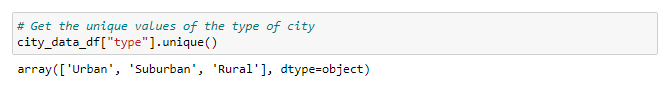

# PyBer_Analysis
Analyzing and visualizing ridesharing data using Python, Pandas, Numpy and Matplolib.

### Resources

  - Python 3.7.6 (64-bit)
  - Anaconda3 

## Overview

The purpose of this project is to perform exploratory analysis of Pyber ride sharing data in order to gain an understanding of ridership and fare metrics by the types of cities in which Pyber operates, and also Creating visualizations of rideshare data for PyBer to help improve ride-sharing services and determine affordability for underserved neighborhoods.

## Ride-sharing summary DataFrame

For this part of project, we follow the steps:
  - Load .csv data files
  - Cleaning the data: missing, malformed, or incorrect data could lead to a poor or incorrect analysis.
  - Mrge data: into a single Pandas DataFrame
  - Check data: Get the name of each column, the number of rows that are not null and the data types.
  - Make a list of city types
  
   
   
  - Get a Summary DataFrame
  
   
   
   
  
   
## 
## Results

## Summary
