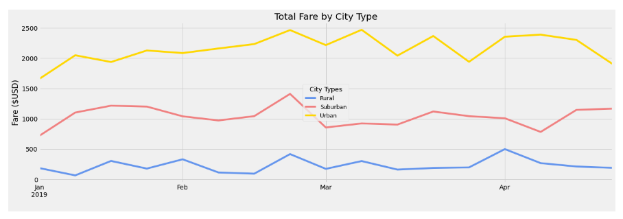

# PyBer_Analysis
Analyzing and visualizing ridesharing data using Python, Pandas, Numpy and Matplolib.

### Resources

  - :card_file_box: Python 3.6.1 (64-bit) : &#160;  [Python 3.6.1](https://www.python.org/downloads/windows/)
  - :card_file_box: Anaconda3 : &#160;  [Anaconda 64-Bit Graphical Installer](https://www.anaconda.com/products/distribution) 

## Overview

The purpose of this project is to perform exploratory analysis of Pyber ride sharing data in order to gain an understanding of ridership and fare metrics by the types of cities in which Pyber operates, and also Creating visualizations of rideshare data for PyBer to help improve ride-sharing services and determine affordability for underserved neighborhoods.
 

## Ride-sharing summary DataFrame by city type
After following steps:
  - The total number of rides for each city type
  - The total number of drivers for each city type
  - The sum of the fares for each city type
  - The average fare per ride for each city type
  - The average fare per driver for each city type
  - The PyBer summary DataFrame
  - The PyBer summary DataFrame is formatted as shown

  
 
By reviewing the summary we can see that there are several key findings including:
  - Urban cities have the highest ridership demand while rural cities have the least.
  - Urban cities have 4x+ more drivers than suburban cities.
  - Suburban cities have 6x+ drivers than rural with almost 4.5x the revenue.
  - Rural cities have the highest average fare per ride and driver.
  - The summary data shows a relationship in which fare revenue is higher by city type when there is a larger ratio of drivers to rides.

   
   
## A multiple-line chart of total fares for each city type
Using Pandas and two new functions, pivot() andresample(), in two steps:
  - create a new DataFrame to show the total fare amount for each date
  - resampled DataFrame using the object-oriented interface method and make a graph

  
   
## 
## Results

## Summary
