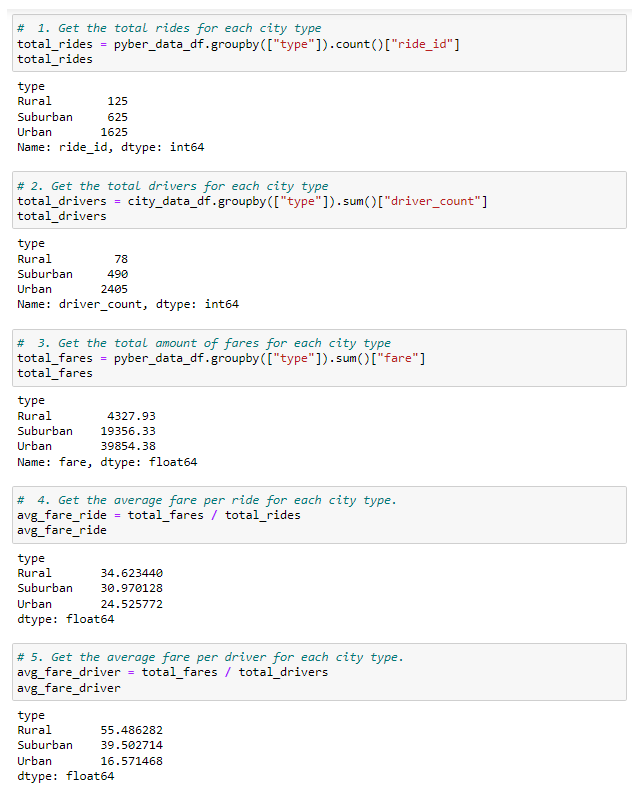

# PyBer_Analysis
Analyzing and visualizing ridesharing data using Python, Pandas, Numpy and Matplolib.

### Resources

  - Python 3.7.6 (64-bit)
  - Anaconda3 

## Overview

The purpose of this project is to perform exploratory analysis of Pyber ride sharing data in order to gain an understanding of ridership and fare metrics by the types of cities in which Pyber operates, and also Creating visualizations of rideshare data for PyBer to help improve ride-sharing services and determine affordability for underserved neighborhoods.

## Ride-sharing summary DataFrame

with the requirements:
  - The total number of rides for each city type is retrieved.
  - The total number of drivers for each city type is retrieved.
  - The sum of the fares for each city type is retrieved.
  - The average fare per ride for each city type is calculated.
  - The average fare per driver for each city type is calculated.
  - A PyBer summary DataFrame
 

      
    
    
 ***Summary DataFrame***
 

 

  
   
   
   
  
   
## 
## Results

## Summary
